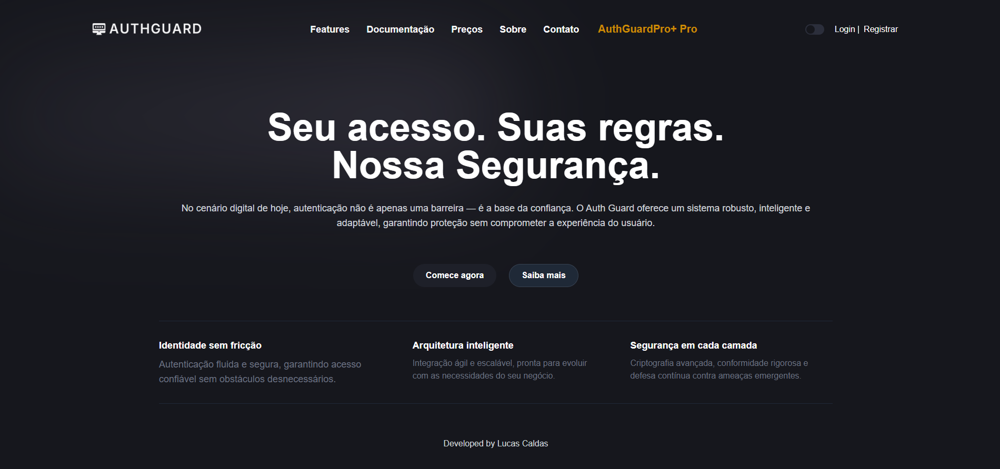
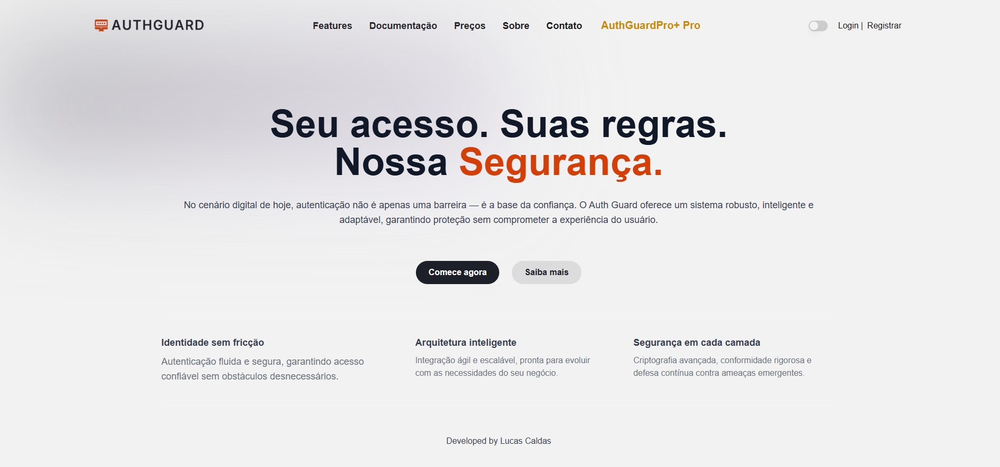
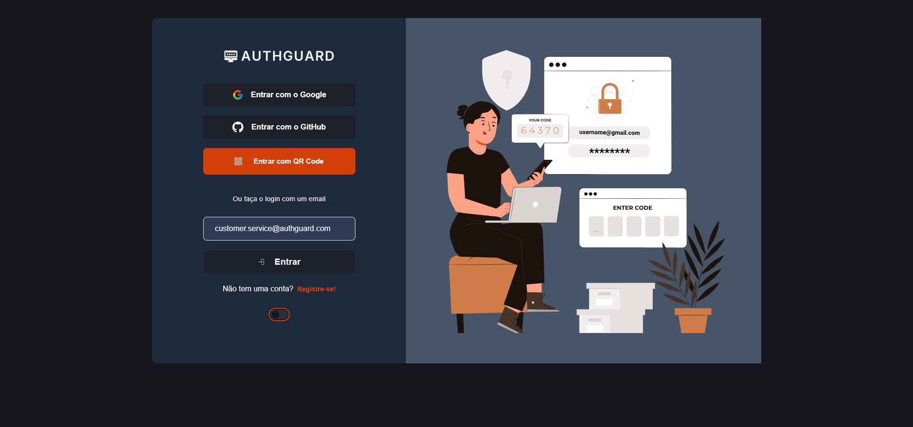
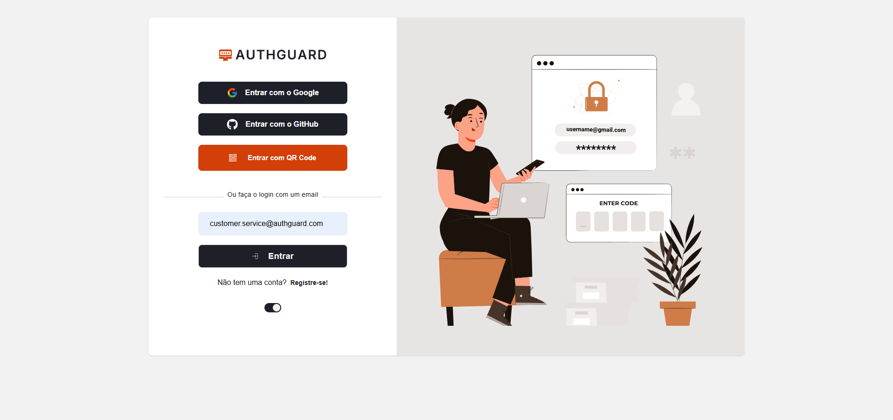
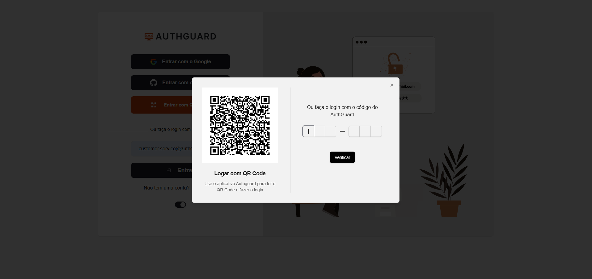

# AuthGuard Frontend

A modern authentication system demo built with [Next.js](https://nextjs.org) that supports multiple authentication methods including Google social login, passwordless email authentication, and QR code-based login. This frontend integrates NextAuth for seamless authentication, while leveraging Resend for email delivery, Tailwind CSS and shadcn for UI components, along with React Hook Form and Yup Resolver for robust form handling and validation.

---

## 🚀 Features

- **Google Social Login**  
  Easily sign in using your Google account via NextAuth.

- **Passwordless Email Authentication**  
  Receive one-time login links via email powered by Resend.

- **QR Code Authentication**  
  Authenticate web sessions by scanning a QR code with a mobile device.

- **Modern UI/UX**  
  Responsive and sleek design with Tailwind CSS and shadcn UI components.

- **Form Validation**  
  Secure and efficient form handling using React Hook Form and Yup Resolver.

---

## 📸 Screenshots

### Home
  


### Login
  


### QR Code Authentication


---

## 🔄 Authentication Flow

1. **Google Social Login**  
   - The user selects the Google login option.  
   - NextAuth handles the redirection to Google OAuth.  
   - Upon user approval, an access token is returned and validated on the backend.  
   - A JWT token is generated and stored for subsequent authenticated requests.

2. **Passwordless Email Authentication**  
   - The user requests a login link via email.  
   - The backend generates a one-time token and sends it using Resend.  
   - The user clicks the link in the email, sending the token back to the backend for verification.  
   - Once validated, a JWT token is issued for secure access.

3. **QR Code Authentication**  
   - The backend generates a QR code with a unique session identifier.  
   - The web page displays the QR code to the user.  
   - The user scans the QR code with the mobile app.  
   - After user confirmation on the mobile app, the session identifier is sent to the backend for authentication.  
   - Upon successful verification, the user is logged into the web session.

---

## 📦 Tech Stack

- **Frontend:** Next.js, React  
- **Authentication:** NextAuth (Google OAuth, Email Token Authentication)  
- **UI Framework:** Tailwind CSS, shadcn UI  
- **Forms & Validation:** React Hook Form, Yup Resolver  
- **Email Delivery:** Resend  
- **Additional Assets:** Custom images in the `public/images` directory

---

## Getting Started

This project was bootstrapped with [`create-next-app`](https://nextjs.org/docs/app/api-reference/cli/create-next-app).

### Run the Development Server

First, install dependencies and run the development server:

```bash
npm install
npm run dev
# or
yarn install
yarn dev
# or
pnpm install
pnpm dev
```
Open http://localhost:3000 with your browser to see the app in action. Edit the page by modifying app/page.tsx – the page will auto-update as you save your changes.

Learn More
----------

To dive deeper into Next.js and related technologies, check out these resources:

*   [Next.js Documentation](https://nextjs.org/docs) – Learn about Next.js features and API.
    
*   [Learn Next.js](https://nextjs.org/learn) – An interactive Next.js tutorial.
    
*   NextAuth Documentation – Comprehensive guide on authentication in Next.js.
    
*   [Resend](https://resend.com) – Learn more about the email service powering passwordless login.
    

Deploy on Vercel
----------------

Deploying your Next.js app is effortless on the [Vercel Platform](https://vercel.com/new?utm_medium=default-template&filter=next.js&utm_source=create-next-app&utm_campaign=create-next-app-readme). For more details, visit the [Next.js deployment documentation](https://nextjs.org/docs/app/building-your-application/deploying).

Contributing
------------

Contributions are welcome! Feel free to submit issues and pull requests to help improve the project.

